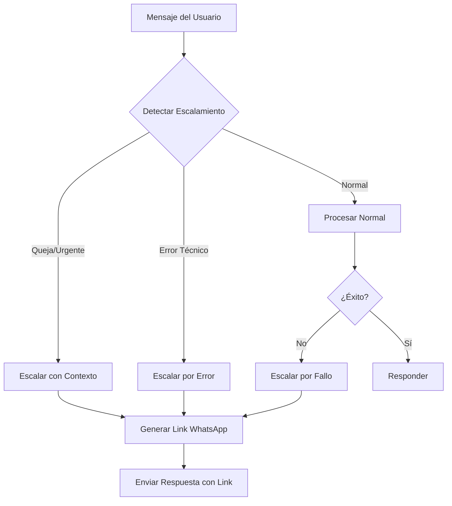

# Sistema de Escalamiento Inteligente - Eva Assistant

## Resumen
Sistema inteligente de escalamiento que detecta automáticamente cuándo una consulta debe ser transferida a un agente humano, proporcionando enlaces directos de WhatsApp para una transición fluida.

## Componentes del Sistema

### 1. Detector de Escalamiento (`escalation_detector.py`)
Analiza mensajes y conversaciones para detectar cuándo escalar:

#### Patrones de Detección:
- **Quejas/Reclamaciones**: "queja", "reclamación", "pésimo", "terrible"
- **Devoluciones**: "devolver", "reembolso", "cancelar pedido"
- **Garantías**: "garantía", "avería", "defectuoso", "roto"
- **Pedidos Especiales**: "pedido especial", "gran cantidad", "presupuesto"
- **Soporte Técnico**: "instalación", "manual técnico", "esquema"
- **Urgencia**: "urgente", "emergencia", "hoy mismo"
- **Frustración**: "no me ayudas", "quiero hablar con alguien"

#### Lógica de Escalamiento:
1. Error técnico → Escalamiento inmediato
2. Patrones detectados → Escalamiento con contexto
3. Múltiples intentos fallidos → Escalamiento por frustración
4. Solicitud explícita de humano → Escalamiento directo

### 2. Utilidades de WhatsApp (`whatsapp_utils.py`)

#### Enlaces de WhatsApp:
```python
# Enlace básico
https://wa.me/34614218122

# Con mensaje predefinido
https://wa.me/34614218122?text=Hola%2C%20necesito%20ayuda%20con%20un%20producto
```

#### Formato de Mensajes de Escalamiento:
```
No encontré el producto que buscas. 

💬 *Un especialista te atenderá personalmente*
👉 https://wa.me/34614218122?text=Hola%2C%20busco%20información%20sobre%3A%20[producto]

_Horario: Lunes a Viernes 9:00-18:00_
```

### 3. Integración en el Agente (`hybrid_agent.py`)

El agente verifica escalamiento en cada mensaje:
1. Antes de procesar → Detecta patrones de escalamiento
2. Durante errores → Escala si hay problemas técnicos
3. Después de fallos → Escala si no puede ayudar

## Flujo de Escalamiento



## Casos de Uso

### 1. Producto No Encontrado
```
Usuario: "Busco producto XYZ123"
Eva: "No encontré el producto que buscas.

💬 *Un especialista te atenderá personalmente*
👉 https://wa.me/34614218122?text=Hola%2C%20busco%20información%20sobre%3A%20producto%20XYZ123

_Horario: Lunes a Viernes 9:00-18:00_"
```

### 2. Cliente Frustrado
```
Usuario: "Esto no sirve, quiero hablar con una persona"
Eva: "Por supuesto.

💬 *Un especialista te atenderá personalmente*
👉 https://wa.me/34614218122?text=El%20cliente%20solicita%20atención%20humana

_Horario: Lunes a Viernes 9:00-18:00_"
```

### 3. Consulta Urgente
```
Usuario: "URGENTE! Necesito 50 ventiladores hoy"
Eva: "Veo que es urgente.

💬 *Un especialista te atenderá personalmente*
👉 https://wa.me/34614218122?text=Hola%2C%20tengo%20una%20consulta%20URGENTE%20que%20necesita%20atención%20inmediata.

_Horario: Lunes a Viernes 9:00-18:00_"
```

### 4. Error Técnico
```
[Error interno del sistema]
Eva: "Tuve un problema técnico al procesar tu consulta.

💬 *Un especialista te atenderá personalmente*
👉 https://wa.me/34614218122?text=Hola%2C%20el%20asistente%20tuvo%20un%20problema%20técnico.%20Necesito%20ayuda.

_Horario: Lunes a Viernes 9:00-18:00_"
```

## Configuración

### Número de WhatsApp
- Número: +34 614 21 81 22
- Formato interno: 34614218122
- Horario: L-V 9:00-18:00

### Personalización de Mensajes
Los mensajes predefinidos se adaptan según el contexto:
- Búsquedas de productos incluyen el término buscado
- Quejas incluyen indicador de cliente molesto
- Urgencias se marcan como URGENTE
- Errores técnicos indican el problema

## Mejores Prácticas

### 1. Escalamiento Inteligente
- Solo escalar cuando realmente es necesario
- Proporcionar contexto al agente humano
- Mantener tono empático y profesional

### 2. Enlaces Efectivos
- URLs completas (no acortadas)
- Mensajes predefinidos relevantes
- Horario de atención visible

### 3. Experiencia del Usuario
- Transición suave bot → humano
- Explicación clara del motivo
- Expectativas de tiempo de respuesta

## Métricas de Escalamiento

El sistema registra:
- Razón del escalamiento
- Frecuencia por tipo
- Tiempo hasta escalamiento
- Resolución post-escalamiento

## Mantenimiento

### Actualizar Número de WhatsApp
Modificar en `/src/utils/whatsapp_utils.py`:
```python
SUPPORT_PHONE = "34614218122"  # Nuevo número
SUPPORT_PHONE_FORMATTED = "+34 614 21 81 22"
```

### Agregar Nuevos Patrones
En `/src/agent/escalation_detector.py`:
```python
self.escalation_patterns = {
    "nueva_categoria": ["palabra1", "palabra2", ...]
}
```

### Personalizar Mensajes
En `/src/utils/whatsapp_utils.py`:
```python
messages = {
    "nueva_razon": "Mensaje personalizado"
}
```

## Consideraciones de Privacidad

- No incluir información sensible en URLs
- Mensajes predefinidos genéricos
- Contexto mínimo necesario
- Cumplimiento RGPD en transferencias