# Eva Chatbot - Arquitectura del Sistema

## Diagrama de Flujo Completo

```mermaid
graph TB
    %% Entradas del Usuario
    subgraph "Canales de Entrada"
        WP[WordPress Chat Widget]
        WA[WhatsApp Business]
        API[API REST]
    end

    %% Servidor Web Principal
    subgraph "FastAPI Server [:8080]"
        WS[WebSocket Handler]
        WH[Webhook Handler]
        REST[REST Endpoints]
    end

    %% Sistema Multi-Agente
    subgraph "Sistema Multi-Agente"
        IC[Intent Classifier<br/>GPT-5]
        SUP[Supervisor Agent<br/>Enrutamiento Inteligente]
        
        subgraph "Agentes Especializados"
            PA[Product Specialist<br/>Búsqueda y Recomendaciones]
            OA[Order Specialist<br/>Gestión de Pedidos]
            SA[Support Agent<br/>Soporte General]
        end
        
        SYN[Synthesis Agent<br/>GPT-5-mini]
    end

    %% Servidor MCP
    subgraph "MCP Server [:8000]"
        subgraph "Herramientas MCP"
            PS[Product Search Tool]
            PD[Product Details Tool]
            OS[Order Status Tool]
            CO[Customer Orders Tool]
            FP[Featured Products Tool]
            CAT[Categories Tool]
        end
    end

    %% Sistema RAG
    subgraph "Sistema RAG"
        KB[Knowledge Base<br/>Documentos Markdown]
        EMB[Embedding Service<br/>text-embedding-3-small]
        
        subgraph "Búsqueda Híbrida"
            VS[Vector Search<br/>60% peso]
            TS[Text Search<br/>40% peso]
            RRF[Reciprocal Rank Fusion]
        end
    end

    %% Base de Datos
    subgraph "PostgreSQL + pgvector"
        PDB[(Products DB<br/>+ Embeddings)]
        KDB[(Knowledge DB<br/>+ Embeddings)]
        MDB[(Memory DB<br/>Conversaciones)]
        CDB[(Cache DB)]
    end

    %% Integraciones Externas
    subgraph "Integraciones Externas"
        WOO[WooCommerce API]
        OAI[OpenAI API<br/>GPT-5/GPT-5-mini]
        D360[360Dialog API<br/>WhatsApp Business]
    end

    %% Servicios Especiales
    subgraph "Servicios Especiales"
        CART[Cart Recovery Service<br/>Recuperación Carritos]
        MEM[Memory Service<br/>Contexto Persistente]
        CONF[Config Service<br/>Personalidad Bot]
        MET[Metrics Service<br/>Análisis y Métricas]
    end

    %% Flujos principales
    WP --> WS
    WA --> WH
    API --> REST
    
    WS --> IC
    WH --> IC
    REST --> IC
    
    IC -->|Clasificación Intent| SUP
    SUP -->|product_search| PA
    SUP -->|order_inquiry| OA
    SUP -->|general_support| SA
    
    PA --> PS
    PA --> PD
    PA --> FP
    PA --> CAT
    OA --> OS
    OA --> CO
    
    PS --> WOO
    PD --> WOO
    OS --> WOO
    CO --> WOO
    FP --> WOO
    CAT --> WOO
    
    PA --> KB
    SA --> KB
    
    KB --> EMB
    EMB --> VS
    EMB --> TS
    VS --> RRF
    TS --> RRF
    RRF --> PA
    
    VS --> PDB
    TS --> PDB
    KB --> KDB
    
    PA --> SYN
    OA --> SYN
    SA --> SYN
    
    SYN --> OAI
    IC --> OAI
    
    SYN -->|Respuesta Final| WS
    SYN -->|Respuesta Final| WH
    
    %% Flujo de recuperación de carritos
    WOO -->|Carrito Abandonado| WH
    WH --> CART
    CART --> D360
    D360 -->|Mensaje WhatsApp| WA
    
    %% Persistencia y métricas
    IC --> MEM
    SYN --> MEM
    MEM --> MDB
    
    IC --> MET
    SYN --> MET
    
    CONF --> SUP
    CONF --> SYN

    %% Estilos
    classDef entrada fill:#e1f5fe,stroke:#01579b,stroke-width:2px
    classDef servidor fill:#f3e5f5,stroke:#4a148c,stroke-width:2px
    classDef agente fill:#fff3e0,stroke:#e65100,stroke-width:2px
    classDef herramienta fill:#e8f5e9,stroke:#1b5e20,stroke-width:2px
    classDef db fill:#fce4ec,stroke:#880e4f,stroke-width:2px
    classDef externo fill:#e3f2fd,stroke:#0d47a1,stroke-width:2px
    classDef servicio fill:#fffde7,stroke:#f57f17,stroke-width:2px
    
    class WP,WA,API entrada
    class WS,WH,REST,PS,PD,OS,CO,FP,CAT servidor
    class IC,SUP,PA,OA,SA,SYN agente
    class KB,EMB,VS,TS,RRF herramienta
    class PDB,KDB,MDB,CDB db
    class WOO,OAI,D360 externo
    class CART,MEM,CONF,MET servicio
```

## Descripción del Flujo

### 1. **Entrada del Usuario**
- Los usuarios pueden interactuar a través de:
  - **WordPress Chat Widget**: Interface web en tiempo real
  - **WhatsApp Business**: Integración con 360Dialog
  - **API REST**: Para integraciones personalizadas

### 2. **Procesamiento Inicial**
- **WebSocket Handler**: Maneja chat en tiempo real
- **Webhook Handler**: Procesa mensajes de WhatsApp y eventos de WooCommerce
- **REST Endpoints**: API para operaciones específicas

### 3. **Sistema Multi-Agente**
- **Intent Classifier (GPT-5)**: Analiza y clasifica la intención del mensaje
- **Supervisor Agent**: Enruta a los agentes especializados según:
  - Tipo de consulta
  - Confianza en la clasificación
  - Contexto de la conversación

### 4. **Agentes Especializados**
- **Product Specialist**: Búsquedas de productos, recomendaciones, comparaciones
- **Order Specialist**: Estado de pedidos, seguimiento, historial
- **Support Agent**: Preguntas generales, políticas, FAQ

### 5. **Servidor MCP (Model Context Protocol)**
- Expone herramientas como endpoints estructurados
- Permite a los agentes ejecutar operaciones de WooCommerce
- Abstrae la complejidad de la API de WooCommerce

### 6. **Sistema RAG (Retrieval-Augmented Generation)**
- **Knowledge Base**: Documentos en Markdown con información de la empresa
- **Embedding Service**: Genera vectores semánticos para búsqueda
- **Búsqueda Híbrida**:
  - Vector Search (60%): Búsqueda semántica
  - Text Search (40%): Búsqueda por palabras clave
  - RRF: Fusiona resultados para mejor precisión

### 7. **Base de Datos PostgreSQL**
- **Products DB**: Productos sincronizados con embeddings
- **Knowledge DB**: Base de conocimientos con embeddings
- **Memory DB**: Historial de conversaciones
- **Cache DB**: Respuestas frecuentes cacheadas

### 8. **Servicios Especiales**
- **Cart Recovery**: Automatiza recuperación de carritos abandonados
- **Memory Service**: Mantiene contexto entre conversaciones
- **Config Service**: Personalidad y configuración del bot
- **Metrics Service**: Analítica y métricas de rendimiento

### 9. **Integraciones Externas**
- **WooCommerce API**: Datos de productos y pedidos en tiempo real
- **OpenAI API**: Modelos de lenguaje para procesamiento
- **360Dialog API**: Envío de mensajes WhatsApp

## Flujos Clave

### Flujo de Búsqueda de Productos
1. Usuario pregunta por un producto
2. Intent Classifier identifica intención "product_search"
3. Supervisor enruta a Product Specialist
4. Product Specialist usa RAG para búsqueda híbrida
5. Consulta WooCommerce para datos actualizados
6. Synthesis Agent genera respuesta personalizada

### Flujo de Recuperación de Carritos
1. WooCommerce detecta carrito abandonado
2. Webhook notifica al sistema
3. Cart Recovery Service procesa información
4. Envía mensaje WhatsApp con descuento via 360Dialog
5. Usuario recibe recordatorio personalizado

### Flujo de Memoria Conversacional
1. Cada interacción se almacena en Memory DB
2. Próximas consultas recuperan contexto previo
3. Agentes consideran historial para respuestas personalizadas
4. Sistema aprende preferencias del cliente

## Mejoras Potenciales

### 1. **Análisis Predictivo**
- Implementar ML para predecir intenciones de compra
- Análisis de patrones de abandono de carrito
- Recomendaciones proactivas basadas en comportamiento

### 2. **Expansión de Canales**
- Integración con Instagram/Facebook Messenger
- Soporte para SMS
- Integración con asistentes de voz

### 3. **Automatización Avanzada**
- Procesamiento automático de devoluciones simples
- Gestión de citas y reservas
- Seguimiento proactivo de envíos

### 4. **Mejoras en RAG**
- Fine-tuning de embeddings específicos del dominio
- Índices especializados por categoría
- Actualización en tiempo real del knowledge base

### 5. **Análisis Avanzado**
- Dashboard en tiempo real con métricas clave
- Análisis de sentimiento de conversaciones
- Predicción de satisfacción del cliente

### 6. **Personalización**
- Perfiles de cliente más detallados
- Respuestas adaptadas al historial de compras
- Ofertas personalizadas basadas en comportamiento